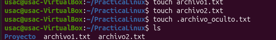
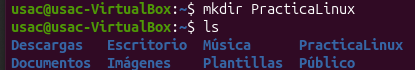
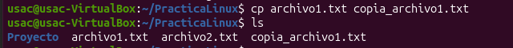
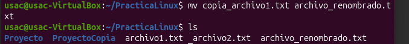
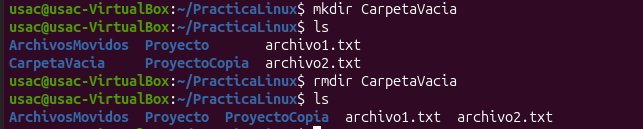
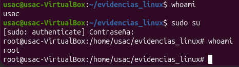
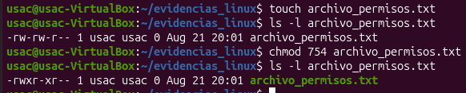
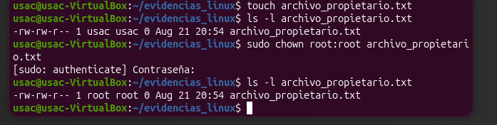
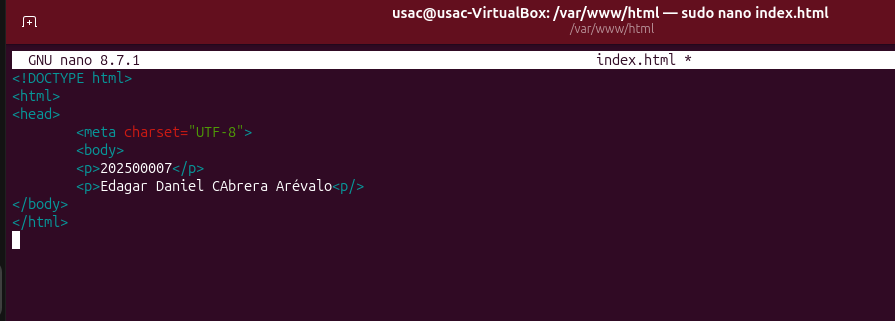

# INTRODUCCIÓN A LINUX Y ENTORNOS EN LA NUBE

<div align="center">

## UNIVERSIDAD DE SAN CARLOS DE GUATEMALA

### FACULTAD DE INGENIERÍA

### PRÁCTICAS INICIALES

<br>

# MANUAL DE INSTALACIÓN Y COMANDOS

## Introducción a Linux y Entornos en la Nube

<br><br>

**Nombre:** Edgar Daniel Cabrera Arévalo  
**Carné:** 202500007  
**Curso:** Prácticas Iniciales  
**Sección:** C  


</div>

---


# Introducción

Linux es un sistema operativo ampliamente utilizado en servidores, centros de datos, plataformas de desarrollo y servicios de computación en la nube. Proveedores como AWS, Google Cloud Platform y Microsoft Azure permiten desplegar múltiples servicios sobre sistemas basados en Linux, por lo que conocer su funcionamiento y dominar el uso de la terminal resulta fundamental dentro de la formación de un Ingeniero en Ciencias y Sistemas.

Ubuntu es una distribución de Linux basada en Debian que destaca por su estabilidad, facilidad de uso, amplia comunidad y disponibilidad de repositorios de software. Además, incorpora herramientas como `apt` para la administración de paquetes y un sistema de usuarios, permisos y privilegios que permite controlar de manera segura el acceso a los recursos del sistema.

En esta actividad se trabajó con Ubuntu desde la interfaz de línea de comandos o **CLI (Command Line Interface)**, utilizando comandos para navegar entre directorios, listar archivos, crear carpetas, copiar, mover y eliminar elementos, administrar privilegios, modificar permisos, editar archivos de texto y gestionar paquetes.

Como aplicación práctica de estos conocimientos, se realizó la instalación y configuración del servidor web **Apache2** exclusivamente mediante la terminal. Posteriormente se modificó el archivo principal `index.html` para mostrar el carné y nombre del estudiante y se verificó el funcionamiento del servidor mediante la dirección local `http://localhost`.

---

# Objetivos

## 1

Identificar y utilizar correctamente los comandos fundamentales de Linux para la navegación, visualización, creación y manipulación de archivos y directorios desde la terminal de Ubuntu.

## 2

Aplicar comandos de administración del sistema relacionados con privilegios de superusuario, permisos, propietarios, edición de archivos y gestión de paquetes mediante `apt`.

## 3

Instalar, verificar y configurar un servidor web Apache2 desde la terminal de Ubuntu, modificando su archivo principal y comprobando su funcionamiento mediante `http://localhost`.

---

# Entorno utilizado

Para la realización de esta actividad se utilizó **Ubuntu mediante una máquina virtual creada en VirtualBox**.

La máquina virtual y el sistema operativo Ubuntu **ya se encontraban instalados y configurados previamente**, debido a que fueron utilizados en una actividad anterior. 

---

#  Investigación y documentación de comandos

##  Gestión de navegación

---

## 4.1.1 Comando `pwd`

### Sintaxis

```bash
pwd
```

### Propósito

El comando `pwd` significa **Print Working Directory** y se utiliza para mostrar la ruta completa del directorio en el cual se encuentra actualmente el usuario.

Es útil para comprobar la ubicación actual dentro del sistema de archivos antes de realizar otras operaciones.

### Variaciones y parámetros

```bash
pwd -L
```

Muestra la ruta lógica actual. Si se ha accedido mediante enlaces simbólicos, conserva la ruta utilizada por el usuario.

```bash
pwd -P
```

Muestra la ruta física real del directorio, resolviendo los enlaces simbólicos.

### Ejemplo práctico

```bash
cd /var/www/html/
pwd
```

Salida esperada:

```text
/var/www/html
```

### Captura


---

##  Comando `cd`

### Sintaxis

```bash
cd [directorio]
```

### Propósito

El comando `cd` significa **Change Directory** y permite cambiar de un directorio a otro dentro del sistema de archivos de Linux.

### Variaciones y parámetros

```bash
cd ~
```

Regresa al directorio personal del usuario.

```bash
cd ..
```

Sube un nivel dentro de la estructura de directorios.

```bash
cd -
```

Regresa al directorio utilizado inmediatamente antes.

```bash
cd /
```

Se desplaza al directorio raíz del sistema.

```bash
cd /ruta/directorio
```

Permite acceder directamente a una ruta absoluta.

### Ejemplo práctico

```bash
cd /var/www/html/
```

Este comando desplaza al usuario al directorio utilizado por Apache2 para almacenar los archivos web.

### Captura


---

#  Lectura de contenido

##  Comando `ls`

### Sintaxis

```bash
ls [opciones] [ruta]
```

### Propósito

El comando `ls` permite listar los archivos y directorios existentes dentro de una ubicación.

### Variaciones y parámetros

```bash
ls
```

Muestra los archivos y directorios visibles de la ubicación actual.

```bash
ls -l
```

Muestra la información en formato largo o detallado, incluyendo permisos, propietario, grupo, tamaño y fecha de modificación.

```bash
ls -a
```

Muestra todos los elementos, incluyendo archivos y directorios ocultos.

```bash
ls -la
```

Combina las opciones `-l` y `-a`, mostrando todos los archivos con información detallada.

```bash
ls -h
```

Cuando se utiliza junto con `-l`, muestra los tamaños en un formato más fácil de leer.

Ejemplo:

```bash
ls -lh
```

### Ejemplo práctico

```bash
cd /var/www/html/
ls -l
```

Este ejemplo permite observar los archivos que Apache2 utiliza para servir contenido web.

### Capturas





---

# Creación de directorios

##  Comando `mkdir`

### Sintaxis

```bash
mkdir [opciones] nombre_directorio
```

### Propósito

El comando `mkdir` significa **Make Directory** y permite crear nuevos directorios desde la terminal.

### Variaciones y parámetros

```bash
mkdir carpeta
```

Crea un directorio simple llamado `carpeta`.

```bash
mkdir -p directorio1/directorio2/directorio3
```

La opción `-p` permite crear una estructura de directorios anidados en una sola instrucción.

```bash
mkdir -v directorio
```

La opción `-v` muestra en pantalla información acerca del directorio que se está creando.

```bash
mkdir carpeta1 carpeta2 carpeta3
```

Permite crear varios directorios al mismo tiempo.

### Ejemplo práctico

```bash
mkdir practica_linux
```

Para crear carpetas anidadas:

```bash
mkdir -p practica_linux/archivos/copias
```

### Capturas




---

# Manipulación de archivos y directorios

##  Comando `cp`

### Sintaxis

```bash
cp [opciones] origen destino
```

### Propósito

El comando `cp` significa **Copy** y se utiliza para copiar archivos o directorios de una ubicación a otra sin eliminar el elemento original.

### Variaciones y parámetros

```bash
cp archivo.txt copia.txt
```

Copia un archivo.

```bash
cp -r directorio destino
```

La opción `-r` realiza una copia recursiva de un directorio y de todo su contenido.

```bash
cp -i archivo destino
```

La opción `-i` solicita confirmación antes de sobrescribir un archivo existente.

```bash
cp -v archivo destino
```

La opción `-v` muestra información acerca de la operación realizada.

### Ejemplo práctico

```bash
cp archivo.txt copia_archivo.txt
```

Ejemplo con un directorio:

```bash
cp -r practica_linux respaldo_practica
```

### Capturas





---

##  Comando `mv`

### Sintaxis

```bash
mv [opciones] origen destino
```

### Propósito

El comando `mv` significa **Move** y permite mover archivos o directorios. También puede utilizarse para cambiarles el nombre.

### Variaciones y parámetros

```bash
mv archivo.txt documentos/
```

Mueve un archivo a otro directorio.

```bash
mv archivo.txt nuevo_nombre.txt
```

Cambia el nombre de un archivo.

```bash
mv -i archivo destino
```

Solicita confirmación antes de sobrescribir un archivo existente.

```bash
mv -n archivo destino
```

Evita sobrescribir archivos existentes.

```bash
mv -v archivo destino
```

Muestra información de la operación realizada.

### Ejemplo práctico

```bash
mv archivo.txt archivo_renombrado.txt
```

En la actividad de Apache2 también se utilizó:

```bash
sudo mv index.html index.html.bak
```

para conservar el archivo original como respaldo.

### Captura



---

##  Comando `rm`

### Sintaxis

```bash
rm [opciones] archivo
```

### Propósito

El comando `rm` significa **Remove** y permite eliminar archivos desde la terminal.

Debe utilizarse con precaución, ya que normalmente los elementos eliminados mediante `rm` no son enviados a la papelera.

### Variaciones y parámetros

```bash
rm archivo.txt
```

Elimina un archivo.

```bash
rm -i archivo.txt
```

Solicita confirmación antes de eliminar el archivo.

```bash
rm -r directorio
```

Elimina un directorio y todo su contenido de forma recursiva.

```bash
rm -f archivo.txt
```

Fuerza la eliminación sin solicitar confirmación.

```bash
rm -rf directorio
```

Elimina de forma recursiva y forzada un directorio. Esta combinación debe utilizarse con especial precaución.

### Ejemplo práctico

```bash
rm archivo_temporal.txt
```

### Captura


---

##  Comando `rmdir`

### Sintaxis

```bash
rmdir [opciones] directorio
```

### Propósito

El comando `rmdir` significa **Remove Directory** y permite eliminar directorios que se encuentren vacíos.

### Variaciones y parámetros

```bash
rmdir carpeta
```

Elimina una carpeta vacía.

```bash
rmdir -v carpeta
```

Muestra información acerca de la eliminación.

```bash
rmdir -p directorio1/directorio2/directorio3
```

Elimina una estructura de directorios vacíos de forma ascendente.

### Ejemplo práctico

```bash
mkdir carpeta_vacia
rmdir carpeta_vacia
```

### Captura



---

#  Elevación de privilegios

##  Comando `sudo`

### Sintaxis

```bash
sudo [opciones] comando
```

### Propósito

El comando `sudo` significa **Superuser Do** y permite ejecutar una instrucción con privilegios administrativos, siempre que el usuario tenga autorización para utilizarlo.

Se utiliza cuando una operación requiere modificar componentes protegidos del sistema, instalar paquetes, administrar servicios o editar archivos pertenecientes al sistema.

### Variaciones y parámetros

```bash
sudo comando
```

Ejecuta únicamente ese comando con privilegios elevados.

```bash
sudo -l
```

Muestra los privilegios y comandos que el usuario tiene permitidos mediante `sudo`.

```bash
sudo -i
```

Inicia una sesión de shell con privilegios administrativos.

```bash
sudo -u usuario comando
```

Ejecuta un comando como otro usuario.

### Ejemplo práctico

```bash
sudo apt update
```

En este ejemplo, `sudo` permite ejecutar la actualización del índice de paquetes con privilegios administrativos.

Otro ejemplo utilizado en la práctica es:

```bash
sudo nano /var/www/html/index.html
```

### Captura


---

##  Comando `su`

### Sintaxis

```bash
su [opciones] [usuario]
```

### Propósito

El comando `su` significa **Substitute User** o **Switch User** y permite cambiar temporalmente a otra cuenta de usuario desde la terminal.

Cuando se utiliza sin indicar un usuario, intenta cambiar a la cuenta `root`.

### Variaciones y parámetros

```bash
su usuario
```

Cambia a la cuenta indicada.

```bash
su -
```

Intenta iniciar una sesión completa como `root`, cargando su entorno.

```bash
su - usuario
```

Inicia una sesión completa como el usuario especificado.

```bash
exit
```

Finaliza la sesión del usuario al que se cambió y regresa al usuario anterior.

### Ejemplo práctico

```bash
su - usuario2
```

Después de finalizar las operaciones:

```bash
exit
```


### Captura 



---

#  Gestión de permisos

##  Comando `chmod`

### Sintaxis

```bash
chmod [opciones] permisos archivo_o_directorio
```

### Propósito

El comando `chmod` significa **Change Mode** y permite modificar los permisos de lectura, escritura y ejecución de archivos y directorios.

Los permisos principales son:

- `r`: lectura (**read**).
- `w`: escritura (**write**).
- `x`: ejecución (**execute**).

Los permisos se aplican a:

- `u`: usuario propietario.
- `g`: grupo.
- `o`: otros usuarios.
- `a`: todos.

### Forma simbólica

Agregar permiso de ejecución al propietario:

```bash
chmod u+x script.sh
```

Quitar permiso de escritura al grupo:

```bash
chmod g-w archivo.txt
```

Agregar permiso de lectura a todos:

```bash
chmod a+r archivo.txt
```

### Forma numérica

Los valores básicos son:

```text
4 = lectura
2 = escritura
1 = ejecución
```

Las combinaciones más comunes son:

```text
7 = lectura + escritura + ejecución
6 = lectura + escritura
5 = lectura + ejecución
4 = solo lectura
```

Ejemplo:

```bash
chmod 755 script.sh
```

Significa:

```text
7 = propietario: lectura, escritura y ejecución
5 = grupo: lectura y ejecución
5 = otros: lectura y ejecución
```

Otro ejemplo:

```bash
chmod 644 archivo.txt
```

Significa:

```text
6 = propietario: lectura y escritura
4 = grupo: lectura
4 = otros: lectura
```

### Ejemplo práctico

```bash
touch ejemplo.sh
chmod u+x ejemplo.sh
ls -l ejemplo.sh
```

El comando `ls -l` permite comprobar el cambio realizado en los permisos.

### Captura



---

##  Comando `chown`

### Sintaxis

```bash
chown [opciones] propietario[:grupo] archivo_o_directorio
```

### Propósito

El comando `chown` significa **Change Owner** y permite cambiar el usuario propietario y, opcionalmente, el grupo propietario de un archivo o directorio.

Por tratarse de una operación administrativa, normalmente se utiliza junto con `sudo`.

### Variaciones y parámetros

Cambiar únicamente el propietario:

```bash
sudo chown usuario archivo.txt
```

Cambiar propietario y grupo:

```bash
sudo chown usuario:grupo archivo.txt
```

Cambiar propietario de un directorio y todo su contenido:

```bash
sudo chown -R usuario:grupo directorio
```

La opción `-R` significa **recursivo**.

### Ejemplo práctico

```bash
sudo chown $USER:$USER archivo.txt
```

Este comando asigna el archivo al usuario y grupo actuales.

Para verificar el cambio:

```bash
ls -l archivo.txt
```

### Captura 



---

#  Edición de texto en consola

##  Editor `nano`

### Sintaxis

```bash
nano [opciones] archivo
```

### Propósito

`nano` es un editor de texto que funciona directamente dentro de la terminal. Permite crear, abrir y modificar archivos sin utilizar una interfaz gráfica.

### Variaciones y parámetros

```bash
nano archivo.txt
```

Abre o crea un archivo.

```bash
sudo nano archivo.txt
```

Abre un archivo con privilegios administrativos.

```bash
nano +10 archivo.txt
```

Abre el archivo y coloca el cursor aproximadamente en la línea indicada.

```bash
nano -l archivo.txt
```

Muestra números de línea mientras se edita el archivo.

### Atajos principales de Nano

```text
Ctrl + O
```

Guarda el archivo.

```text
Enter
```

Confirma el nombre del archivo al guardar.

```text
Ctrl + X
```

Sale de Nano.

```text
Ctrl + W
```

Permite buscar texto dentro del archivo.

```text
Ctrl + K
```

Corta la línea actual.

```text
Ctrl + U
```

Pega el contenido previamente cortado.

### Ejemplo práctico

```bash
sudo nano /var/www/html/index.html
```

Este fue el editor utilizado para modificar el archivo principal del servidor Apache2.

### Captura



---

#  Gestión de paquetes con `apt`

`apt` es una herramienta de administración de paquetes utilizada en Ubuntu y otras distribuciones basadas en Debian. Permite consultar repositorios, instalar programas, actualizar paquetes y eliminar software desde la terminal.

La forma general es:

```bash
sudo apt [acción] [paquete]
```

---

## 4.8.1 `apt update`

### Sintaxis

```bash
sudo apt update
```

### Propósito

Actualiza el índice local de paquetes disponibles consultando los repositorios configurados en el sistema.

Este comando **no actualiza directamente los programas instalados**; únicamente actualiza la información disponible acerca de versiones y paquetes.

### Ejemplo práctico

```bash
sudo apt update
```

### Capturas


---

##  `apt install`

### Sintaxis

```bash
sudo apt install nombre_paquete
```

### Propósito

Instala uno o más paquetes y las dependencias necesarias para su funcionamiento.

### Variaciones y parámetros

```bash
sudo apt install paquete1 paquete2
```

Instala varios paquetes en una misma instrucción.

```bash
sudo apt install -y nombre_paquete
```

La opción `-y` responde afirmativamente de manera automática a las confirmaciones.

```bash
sudo apt install --reinstall nombre_paquete
```

Reinstala un paquete que ya se encuentra instalado.

### Ejemplo práctico

```bash
sudo apt install apache2
```

### Captura


---

##  `apt upgrade`

### Sintaxis

```bash
sudo apt upgrade
```

### Propósito

Actualiza a versiones más recientes los paquetes que ya se encuentran instalados, utilizando la información obtenida previamente mediante `apt update`.

Normalmente se utiliza después de:

```bash
sudo apt update
```

### Variaciones y parámetros

```bash
sudo apt upgrade -y
```

Acepta automáticamente la actualización de los paquetes.

### Ejemplo práctico

```bash
sudo apt update
sudo apt upgrade
```

### Captura 


---

##  `apt remove`

### Sintaxis

```bash
sudo apt remove nombre_paquete
```

### Propósito

Elimina un paquete instalado, pero normalmente conserva sus archivos de configuración.

### Variaciones y parámetros

```bash
sudo apt remove -y nombre_paquete
```

Realiza la eliminación aceptando automáticamente la confirmación.

### Ejemplo práctico

```bash
sudo apt remove nombre_paquete
```


##  `apt purge`

### Sintaxis

```bash
sudo apt purge nombre_paquete
```

### Propósito

Elimina un paquete y también sus archivos de configuración administrados por el sistema de paquetes.

La diferencia principal respecto a `apt remove` es que `purge` realiza una eliminación más completa de la configuración del paquete.

### Ejemplo práctico

```bash
sudo apt purge nombre_paquete
```


##  Comando complementario `apt autoremove`

Aunque no es uno de los comandos principales solicitados, es útil conocer:

```bash
sudo apt autoremove
```

Este comando elimina dependencias que fueron instaladas automáticamente y que ya no son necesarias.

---

#  Actividad práctica: instalación y configuración de Apache2

Esta sección documenta la secuencia ejecutada exclusivamente desde la terminal de Ubuntu para instalar y configurar el servidor web Apache2.

---

# Actualización del índice de paquetes

## Comando utilizado

```bash
sudo apt update
```

## Descripción

El comando actualiza la información acerca de los paquetes disponibles en los repositorios configurados en Ubuntu.

Está formado por:

- `sudo`: ejecuta el comando con privilegios administrativos.
- `apt`: administra los paquetes del sistema.
- `update`: actualiza el índice local de paquetes.

Al ejecutar el comando, Ubuntu puede solicitar la contraseña del usuario:

```text
[sudo] password for usuario:
```

Mientras se escribe la contraseña no se muestran letras, puntos ni asteriscos. Esto es normal y corresponde a una medida de seguridad.

Al finalizar correctamente pueden aparecer mensajes similares a:

```text
Reading package lists... Done
Building dependency tree... Done
Reading state information... Done
```

## Evidencia


---

# Instalación del servidor Apache2

## Comando utilizado

```bash
sudo apt install apache2
```

## Descripción

Este comando instala el paquete `apache2` y las dependencias necesarias para el funcionamiento del servidor web.

Durante la instalación puede mostrarse una confirmación:

```text
Do you want to continue? [Y/n]
```

o:

```text
¿Desea continuar? [S/n]
```

Una vez terminada la instalación, el servidor queda disponible en el sistema.

## Evidencia


---

#  Verificación del estado de Apache2

## Comando utilizado

```bash
sudo systemctl status apache2
```

## Descripción

`systemctl` es una herramienta utilizada para administrar y consultar servicios controlados por `systemd`.

En este caso:

- `systemctl`: administra servicios.
- `status`: consulta el estado.
- `apache2`: es el servicio consultado.

Si Apache2 funciona correctamente debe observarse una línea similar a:

```text
Active: active (running)
```

Esto confirma que el servicio se encuentra activo y ejecutándose.

Para salir de la vista del estado se utiliza:

```text
q
```

## Comando opcional si el servicio estuviera detenido

Si el estado no apareciera como activo, puede iniciarse mediante:

```bash
sudo systemctl start apache2
```

Después se vuelve a comprobar con:

```bash
sudo systemctl status apache2
```


---

#  Verificación inicial desde el navegador

## Dirección utilizada

```text
http://localhost
```

## Descripción

`localhost` representa la propia computadora en la que se está ejecutando Apache2.

Al acceder a:

```text
http://localhost
```

el navegador realiza una solicitud HTTP al servidor Apache2 local.

Si el servidor funciona correctamente, se muestra la página predeterminada de Apache2. Esta prueba confirma que:

- Apache2 está instalado.
- El servicio está activo.
- El servidor responde a solicitudes HTTP.
- El navegador puede comunicarse con el servidor local.

Apache2 utiliza normalmente el puerto HTTP `80`.

## Evidencia


---


#  Conclusiones

## Conclusión 1 

Se identificaron y utilizaron los principales comandos de Linux para navegar por el sistema de archivos, consultar la ubicación actual, listar contenido, crear directorios y manipular archivos. El uso de comandos como `pwd`, `cd`, `ls`, `mkdir`, `cp`, `mv`, `rm` y `rmdir` permitió comprender cómo realizar operaciones básicas de administración directamente desde la terminal de Ubuntu.

## Conclusión 2 

Se aplicaron herramientas de administración del sistema relacionadas con privilegios, permisos, propietarios, edición de archivos y gestión de paquetes. Los comandos `sudo`, `su`, `chmod`, `chown` y `apt`, junto con el editor `nano`, permitieron reconocer la importancia del control de acceso y de la administración de software dentro de un entorno Linux.

## Conclusión 3 

Se instaló y verificó correctamente el servidor web Apache2 mediante comandos de terminal, se accedió al directorio `/var/www/html/`, se modificó el archivo `index.html` y se comprobó el resultado desde `http://localhost`. Con ello se demostró de forma práctica cómo un sistema Ubuntu puede configurarse para proporcionar un servicio web local sin depender de herramientas gráficas de administración.

---


