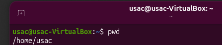
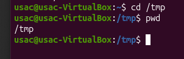

# Tarea Informe 3

## Datos 

**Nombre:** Edgar Daniel Cabrera Arévalo
**Carné:** 202500007 
**Curso:** Prácticas Iniciales  
**Sección:** C  


---

## Entorno utilizado

Para la realización de esta práctica se utilizó **Ubuntu mediante una máquina virtual en VirtualBox**. Ubuntu ya se encontraba instalado y configurado previamente, debido a que fue utilizado en el informe anterior. Por esta razón, en este documento se trabaja directamente con los comandos básicos solicitados.

---

# 2. Comandos de Navegación

## 2.1 Comando `pwd`

### Comando

```bash
pwd
```

### ¿Qué hace?

El comando `pwd` significa **Print Working Directory** y permite mostrar la ruta completa del directorio en el que se encuentra actualmente el usuario.

### Variaciones

```bash
pwd -L
```

Muestra la ruta lógica actual.

```bash
pwd -P
```

Muestra la ruta física real del directorio.

### Captura



---

## 2.2 Comando `cd`

### Comando

```bash
cd [directorio]
```

### ¿Qué hace?

El comando `cd` significa **Change Directory** y permite cambiar de un directorio a otro dentro del sistema de archivos.

### Variaciones

```bash
cd ~
```

Permite regresar al directorio personal del usuario.

```bash
cd ..
```

Permite subir un nivel dentro de la estructura de directorios.

```bash
cd -
```

Permite regresar al directorio utilizado anteriormente.

```bash
cd /ruta/directorio
```

Permite acceder directamente a una ruta específica.

### Captura



---

# 3. Comandos de Listado y Creación

## 3.1 Comando `ls`

### Comando

```bash
ls
```

### ¿Qué hace?

El comando `ls` permite mostrar los archivos y directorios que se encuentran dentro del directorio actual.

### Variaciones

```bash
ls -l
```

Muestra los archivos y directorios en formato detallado, incluyendo información como permisos, propietario, tamaño y fecha de modificación.

```bash
ls -a
```

Muestra todos los archivos y directorios, incluyendo los archivos ocultos.

```bash
ls -la
```

Combina las opciones `-l` y `-a`, mostrando todos los archivos, incluidos los ocultos, junto con información detallada.

### Captura de `ls`


---
## 3.2 Comando `mkdir`

### Comando

```bash
mkdir [nombre_directorio]
```

### ¿Qué hace?

El comando `mkdir` significa **Make Directory** y permite crear nuevos directorios o carpetas desde la terminal.

### Variaciones

```bash
mkdir -p directorio1/directorio2/directorio3
```

La opción `-p` permite crear varios directorios anidados en una sola instrucción.

```bash
mkdir -v directorio
```

La opción `-v` muestra información sobre el directorio que está siendo creado.

### Captura de `mkdir`


---

# 4. Comandos de Manipulación de Archivos

## 4.1 Comando `cp`

### Comando

```bash
cp [origen] [destino]
```

### ¿Qué hace?

El comando `cp` significa **Copy** y se utiliza para copiar archivos o directorios de una ubicación a otra sin modificar el archivo original.

### Variaciones

```bash
cp -r directorio destino
```

La opción `-r` permite copiar un directorio junto con todos los archivos y subdirectorios que contiene.

```bash
cp -i archivo destino
```

La opción `-i` solicita confirmación antes de sobrescribir un archivo existente.

```bash
cp -v archivo destino
```

La opción `-v` muestra información sobre los archivos que están siendo copiados.

### Captura


---

## 4.2 Comando `mv`

### Comando

```bash
mv [origen] [destino]
```

### ¿Qué hace?

El comando `mv` significa **Move** y permite mover archivos o directorios de una ubicación a otra. También puede utilizarse para cambiar el nombre de un archivo o directorio.

### Variaciones

```bash
mv -i archivo destino
```

La opción `-i` solicita confirmación antes de sobrescribir un archivo existente.

```bash
mv -n archivo destino
```

La opción `-n` evita sobrescribir archivos existentes.

```bash
mv -v archivo destino
```

La opción `-v` muestra información sobre la operación realizada.

### Captura


---

## 4.3 Comando `rm`

### Comando

```bash
rm [archivo]
```

### ¿Qué hace?

El comando `rm` significa **Remove** y permite eliminar archivos desde la terminal.

Debe utilizarse con precaución debido a que los archivos eliminados mediante este comando normalmente no son enviados a la papelera.

### Variaciones

```bash
rm -i archivo
```

La opción `-i` solicita confirmación antes de eliminar el archivo.

```bash
rm -r directorio
```

La opción `-r` permite eliminar un directorio junto con los archivos y subdirectorios que contiene.

```bash
rm -f archivo
```

La opción `-f` fuerza la eliminación del archivo sin solicitar confirmación.

### Captura


---

## 4.4 Comando `rmdir`

### Comando

```bash
rmdir [directorio]
```

### ¿Qué hace?

El comando `rmdir` significa **Remove Directory** y permite eliminar directorios que se encuentren vacíos.

### Variaciones

```bash
rmdir -v directorio
```

La opción `-v` muestra información sobre el directorio que está siendo eliminado.

```bash
rmdir -p directorio1/directorio2/directorio3
```

La opción `-p` permite eliminar una estructura de directorios anidados siempre que estos se encuentren vacíos.

### Captura

---